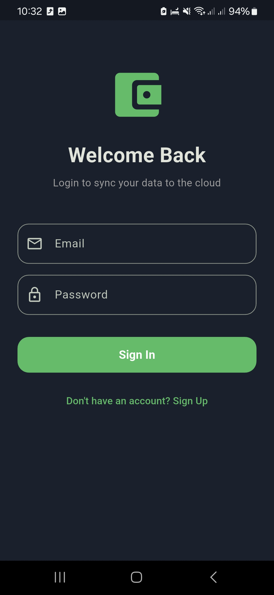
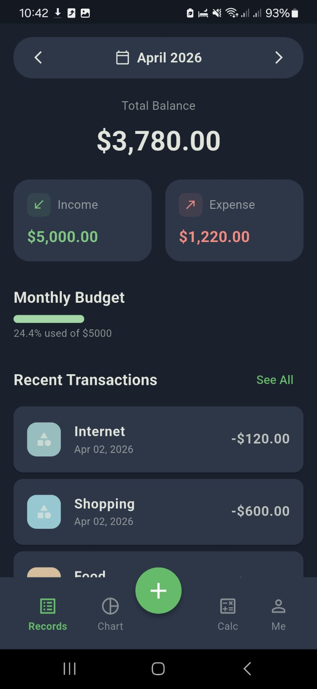
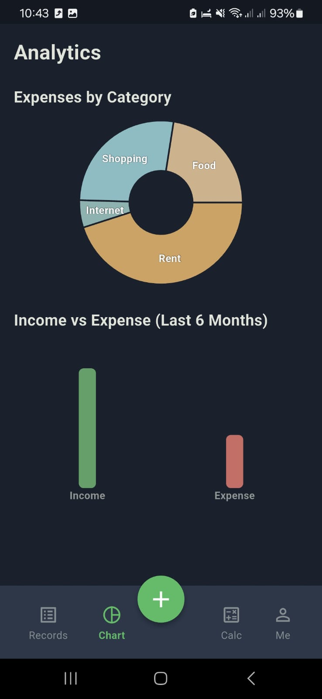
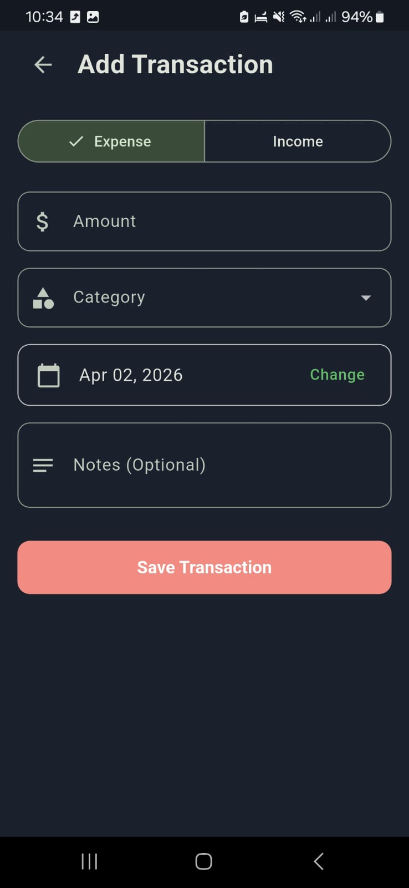
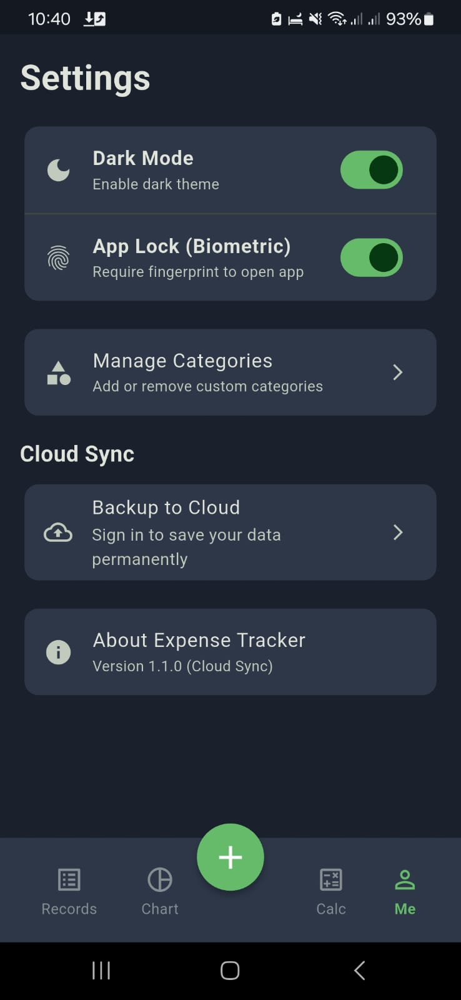

# budget

A premium, minimalist expense tracker built with Flutter, designed for security and seamless cloud synchronization.

[](https://flutter.dev)
[](https://firebase.google.com)
[](https://opensource.org/licenses/MIT)

---

## ✨ Features

- ☁️ **Cloud Synchronization**: Real-time data backup and cross-device sync powered by **Firebase Firestore**.
- 🔒 **Biometric Security**: Advanced privacy protection using Fingerprint or Face ID authentication.
- 📊 **Dynamic Analytics**: Visualized spending habits through interactive and responsive charts.
- 🌙 **Modern UX**: Smooth, high-performance UI with refined animations and support for both Light and Dark modes.
- 🏛️ **Robust Architecture**: Built with **BLoC** for scalable state management and clean code principles.
- 📁 **Offline Support**: Local data persistence using **Hive** for a fast, offline-first experience.

---

## 📸 Usage & UI

*Please insert your real app screenshots into the `./screenshots/` directory using the filenames specified below:*

| Screen | Live App Screenshot | Description |
| :--- | :--- | :--- |
| **Welcome** |  | The premium animated entry screen showcasing the 'budget' logo. |
| **Authentication** |  | The secure login and registration interface with Firebase integration. |
| **Dashboard** |  | The overview of current balance, recent expenses, and quick actions. |
| **Analytics** |  | Visual breakdown of expenses by category with interactive charts. |
| **Operations** |  | Simple and intuitive transaction logging. |
| **Settings** |  | Personalized settings and biometric security configuration. |

---

## 🛠️ Tech Stack

- **Framework**: [Flutter](https://flutter.dev/)
- **State Management**: [flutter_bloc](https://pub.dev/packages/flutter_bloc)
- **Local Storage**: [Hive](https://pub.dev/packages/hive)
- **Backend Services**: [Firebase Authentication](https://firebase.google.com/docs/auth), [Cloud Firestore](https://firebase.google.com/docs/firestore)
- **Animations**: [flutter_animate](https://pub.dev/packages/flutter_animate)
- **Dependency Injection**: [get_it](https://pub.dev/packages/get_it)

---

## 🚀 Getting Started

### Prerequisites

- Flutter SDK (v3.0+)
- Firebase CLI (for cloud configuration)
- A Firebase project created in the [Firebase Console](https://console.firebase.google.com/)

### Installation

1. **Clone the repository**:
   ```bash
   git clone https://github.com/yourusername/budget.git
   cd budget
   ```

2. **Install dependencies**:
   ```bash
   flutter pub get
   ```

3. **Firebase Configuration**:
   - Ensure `firebase_options.dart` is correctly configured for your project.
   - For Android, place your `google-services.json` in `android/app/`.
   - For iOS, place `GoogleService-Info.plist` in `ios/Runner/`.

4. **Run the application**:
   ```bash
   flutter run --release
   ```

---

## 🤝 Contributing

Contributions are what make the open-source community such an amazing place to learn, inspire, and create. Any contributions you make are **greatly appreciated**.

1. Fork the Project
2. Create your Feature Branch (`git checkout -b feature/AmazingFeature`)
3. Commit your Changes (`git commit -m 'Add some AmazingFeature'`)
4. Push to the Branch (`git push origin feature/AmazingFeature`)
5. Open a Pull Request

---

## 📄 License

This project is licensed under the MIT License - see the [LICENSE](LICENSE) file for details.

---
<div align="center">
  Built with ❤️ for financial clarity.
</div>
